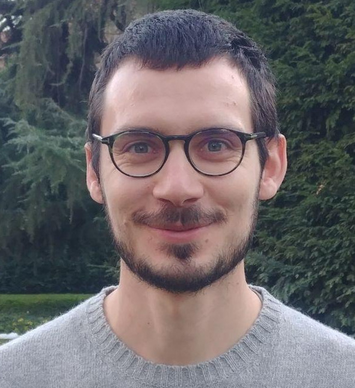

## Short bio

 
I am a postdoctoral researcher at the Department of Environmental Microbiology at Eawag (Switzerland) in the Microbial Specialized Metabolism led by Dr. Serina Robinson.  
I obtained both my bachelor and my master degree in Environmental and Land Planning Engineering from Politecnico di Milano respectively in 2016 and 2019, completing part of my M.Sc. thesis at Danmarks Tekniske Universitet (Denmark) under the supervision of Dr. Luca Vezzaro and Dr. Stefan Trapp.  
I carried out my Ph.D. at Politecnico di Milano (Italy) under the supervision of Dr. Manuela Antonelli focusing on developing monitoring strategies for drinking water distribution systems and the characterization of the drinking water microbiome and its dynamics. 
During this period I also visited the Georgia Institute of Technology (USA) to carry out research under the supervision of Dr. Ameet Pinto, applying metagenomics for the characterization of eukaryotic communities in drinking water systems.  
After my Ph.d., I worked with Dr. Frederik Hammes at Eawag to investigate the genomic diversity of <i>Legionellaceae</i> species and to elucidate the eukaryotic and prokaryotic microbial ecology of drinking water biofilms and its impacts on <i>Legionella</i> spp. survival.

## Research interest

 
My research interests revolve around microbial adaptation and its implication community assembly and their impact anthropic infrastructures and biotechnological applications. In particular this focus area is declined into the study of the ecological role of secondary metabolites in microbial adaptation to secondary environments and understanding the ecological processes occurring in drinking water to pave the way for new ecologically-sound management strategies.  
Previous research activities have been linked to the optimization of monitoring strategies, as well as agricultural wastewater reuse focusing on modelling the fate of contaminants of emerging concern in wastewater treatment plants, receiving waters and agricultural fields.

## Contacts
Email: marco.gabrielli at eawag.ch \
Blue Sky: <a href="https://bsky.app/profile/mgabrielli.bsky.social">mgabrielli</a> \
Github: <a href="https://github.com/mgabriell1">mgabriell1</a>

